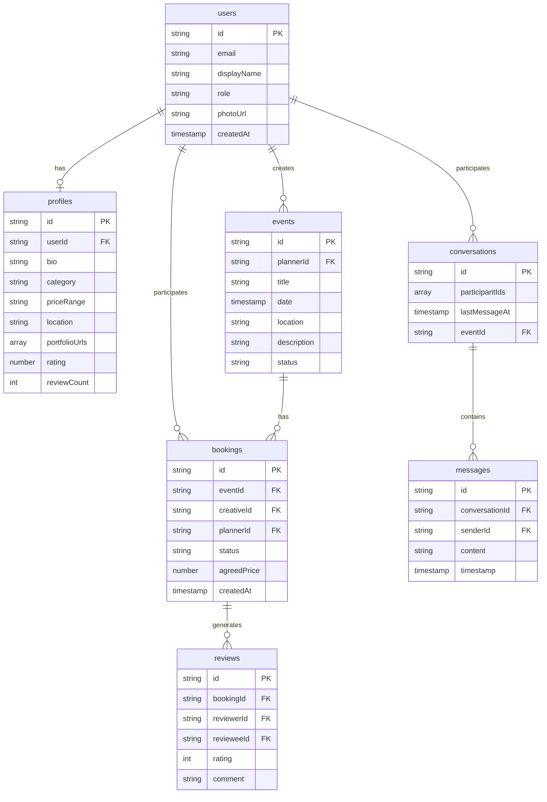

# LinkStage Entity-Relationship Diagram

## Overview

This document defines the Firestore data model for LinkStage. Field names in code must match the collection and field names below.

## ERD Diagram

## Firestore Collections

### users

| Field        | Type     | Description                                |
| ------------ | -------- | ------------------------------------------ |
| id           | string   | Primary key (Firebase Auth UID)            |
| email        | string   | User email                                 |
| displayName  | string   | Display name                               |
| role         | string   | `event_planner` or `creative_professional` |
| photoUrl     | string?  | Profile photo URL                          |
| createdAt    | timestamp| Creation time                              |

### profiles

| Field             | Type   | Description                                                    |
| ----------------- | ------ | -------------------------------------------------------------- |
| id                | string | Document ID                                                    |
| userId            | string | FK to users.id                                                 |
| bio               | string | Bio/description                                                |
| category          | string | `dj`, `photographer`, `decorator`, `content_creator`           |
| priceRange        | string | e.g. "50,000-100,000 RWF"                                     |
| location          | string | Location                                                       |
| portfolioUrls     | array  | Portfolio image URLs (hosted on Supabase Storage)               |
| portfolioVideoUrls| array  | Portfolio video URLs (hosted on Supabase Storage)               |
| availability      | string | `open_to_work` or `not_available`                              |
| services          | array  | Services and specializations (e.g. DJ, weddings, photography)   |
| languages         | array  | List of language codes                                         |
| professions       | array  | User-typed professions (e.g. DJ, photographer)                  |
| rating            | number | Average rating                                                 |
| reviewCount       | int    | Number of reviews                                              |

### events

| Field     | Type     | Description                              |
| --------- | -------- | ---------------------------------------- |
| id        | string   | Document ID                              |
| plannerId | string   | FK to users.id                           |
| title     | string   | Event title                              |
| date      | timestamp| Event date                               |
| location  | string   | Event location                           |
| description | string | Event description                        |
| status    | string   | `draft`, `open`, `booked`, `completed`   |
| imageUrls | array    | Event image URLs (hosted on Supabase Storage) |

### bookings

| Field      | Type     | Description                              |
| ---------- | -------- | ---------------------------------------- |
| id         | string   | Document ID                              |
| eventId    | string   | FK to events.id                          |
| creativeId | string   | FK to users.id                           |
| plannerId  | string   | FK to users.id                           |
| status     | string   | `pending`, `accepted`, `declined`, `completed` |
| agreedPrice| number   | Agreed price in RWF                      |
| createdAt  | timestamp| Creation time                            |

Planner dashboard uses `getPendingBookingsByPlannerId(plannerId)` (query: `plannerId` + `status == 'pending'`, orderBy `createdAt` desc) for applicants count, recent activity, and per-event "+N New" counts.

### conversations

| Field          | Type     | Description           |
| -------------- | -------- | --------------------- |
| id             | string   | Document ID           |
| participantIds | array    | User IDs in conversation |
| lastMessageAt  | timestamp| Last message time     |
| eventId        | string?  | Optional linked event |

### conversations/{id}/messages (subcollection)

| Field           | Type     | Description   |
| --------------- | -------- | ------------- |
| id              | string   | Document ID   |
| conversationId  | string   | Parent conv ID|
| senderId        | string   | FK to users   |
| content         | string   | Message text  |
| timestamp       | timestamp| Send time     |

### reviews

| Field      | Type     | Description                         |
| ---------- | -------- | ----------------------------------- |
| id         | string   | Document ID                         |
| bookingId  | string   | FK to bookings.id                   |
| reviewerId | string   | FK to users.id (who wrote it)       |
| revieweeId | string   | FK to users.id (who is reviewed)    |
| rating     | int      | 1-5 stars                           |
| comment    | string   | Review text                         |
| createdAt  | timestamp| When review was created             |
| reply      | string   | Reviewee's reply                    |
| replyAt    | timestamp| When reply was added                |
| likeCount  | int      | Number of likes                     |
| likedBy    | array    | User IDs who liked                  |
| flagCount  | int      | Number of flags                     |
| flaggedBy  | array    | User IDs who flagged                |

## Storage (Supabase)

Portfolio media (images and videos) are stored in Supabase Storage at `users/{userId}/portfolio/images/` and `users/{userId}/portfolio/videos/`. Profile documents in Firestore store the resulting public URLs in `portfolioUrls` and `portfolioVideoUrls`.

Uploads go through the `portfolio-upload` Edge Function, which verifies the Firebase ID token before writing. Ensure Supabase storage policies (RLS) restrict direct client writes; the Edge Function should use the service role for storage writes.

## Composite Indexes

Defined in `firestore.indexes.json`:

- events: plannerId (ASC) + date (DESC)
- bookings: creativeId (ASC) + status (ASC)
- bookings: plannerId (ASC) + status (ASC)
- bookings: plannerId (ASC) + status (ASC) + createdAt (DESC) — for planner dashboard (pending bookings by planner, ordered by creation time)
- profiles: category (ASC) + location (ASC)
- profiles: category (ASC) + rating (DESC)
